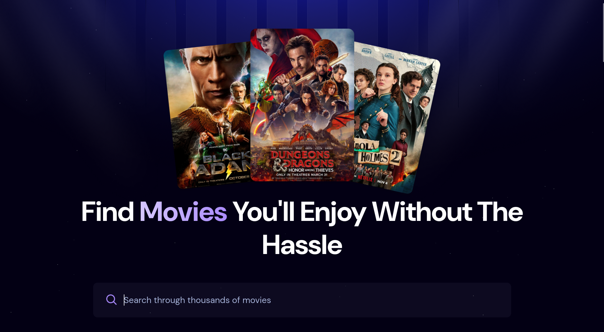
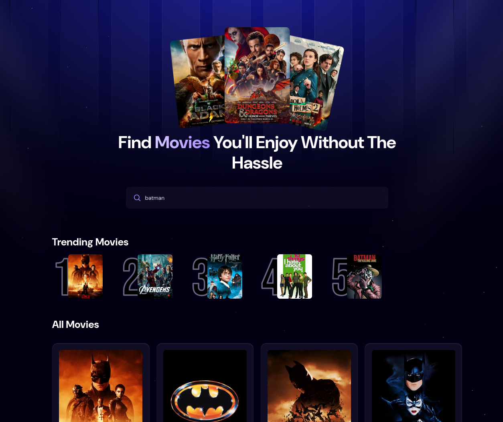

# Movie App


A modern React application for discovering and searching movies with real-time popularity tracking and optimized search performance.

## Table of Contents

- [Features](#features)
  - [Movie Discovery](#-movie-discovery)
  - [Debounced Search](#-debounced-search)
  - [Real-time Popularity Backend](#-real-time-popularity-backend)
  - [Optimized Experience](#-optimized-experience)
- [Tech Stack](#tech-stack)
- [Screenshots](#screenshots)
- [Getting Started](#getting-started)
- [Appwrite Configuration](#appwrite-configuration)
- [How It Works](#how-it-works)
- [Project Structure](#project-structure)

## Features

### 🎬 Movie Discovery
- Browse trending movies with real-time popularity rankings
- Search through thousands of movies using The Movie Database (TMDB) API
- View movie poster thumbnails and summary details
- Discover popular movies sorted by popularity

### ⚡ Debounced Search
- Implements 500ms debounce on search input to reduce API calls
- Prevents excessive requests while users are typing
- Improves performance and reduces server load
- Provides a smooth, responsive search experience

### 📊 Real-time Popularity Backend
- Tracks search query popularity using Appwrite backend
- Automatically updates search counts when movies are found
- Displays trending searches based on user engagement
- Persists popularity data for analytics

### 🔄 Optimized Experience
- Loading states with spinner component
- User-friendly error handling
- Responsive layout for all screen sizes

## Tech Stack

- **React**: JavaScript library for building dynamic user interfaces
- **Vite**: Fast build tool and development server with HMR
- **Tailwind CSS**: Utility-first CSS framework for rapid UI styling
- **HTML5**: Semantic markup for structured content
- **CSS3**: Custom styling with layout and gradients
- **JavaScript**: Core programming language for interactivity
- **Appwrite**: Backend-as-a-service for real-time data tracking
- **TMDB API**: Movie database for search and trending data
- **react-use**: Custom React hooks for debouncing

## Screenshots

### Home Page

*Main landing page with trending movies and search functionality.*

### Search Results

*Search results showing movie cards and poster images.*

## Getting Started

### Prerequisites
- Node.js (v16 or higher)
- TMDB API key from [The Movie Database](https://www.themoviedb.org/settings/api)
- Appwrite instance (local or cloud)

### Environment Setup

Create a `.env.local` file in the root directory:

```env
VITE_TMDB_API_KEY=your_tmdb_api_key_here
VITE_APPWRITE_PROJECT_ID=your_project_id
VITE_APPWRITE_DATABASE_ID=your_database_id
VITE_APPWRITE_TABLE_ID=your_table_id
```

### Installation

```bash
npm install
npm run dev
```

Open [http://localhost:5173](http://localhost:5173)

## Appwrite Configuration

The app uses Appwrite TablesDB to track search popularity.

- **Table fields**:
  - `searchTerm` (String)
  - `count` (Integer)
  - `movie_id` (Integer)
  - `poster_url` (String)

- **Permissions**:
  - Read access for trending data
  - Write access to update search counts

- **Appwrite client setup** (see [src/appwrite.js](src/appwrite.js)):

```javascript
import { Client, Query, TablesDB, ID } from "appwrite";

const client = new Client()
  .setEndpoint('https://cloud.appwrite.io/v1')
  .setProject(import.meta.env.VITE_APPWRITE_PROJECT_ID);

const database = new TablesDB(client);
```

## How It Works

- **Search flow**: User types → 500ms debounce waits → API call made → results displayed
- **Trending tracking**: Each successful search updates Appwrite popularity data
- **Trending display**: Shows most-searched items ordered by search count

## Project Structure

```text
src/
├── components/
│   ├── Search.jsx
│   ├── MovieCard.jsx
│   └── Spinner.jsx
├── App.jsx
├── appwrite.js
└── index.css
```
